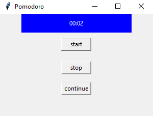
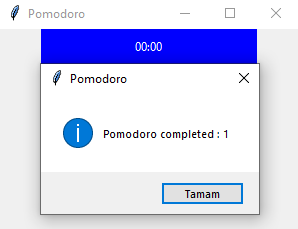

# Read Me
This Function creates pomodoro app with tkinter.application allows you to work for the set amount of time and then manages the work cycle with short and long breaks. Each completed Pomodoro cycle is shown on the screen.
After one pomodoro session (25min), starts a short
break(5min) and counts your pomodoro sessions.
# Usage
just run " python pomodoro.py " in terminal
# Showcase

## Author
Furkan Sarsilmaz